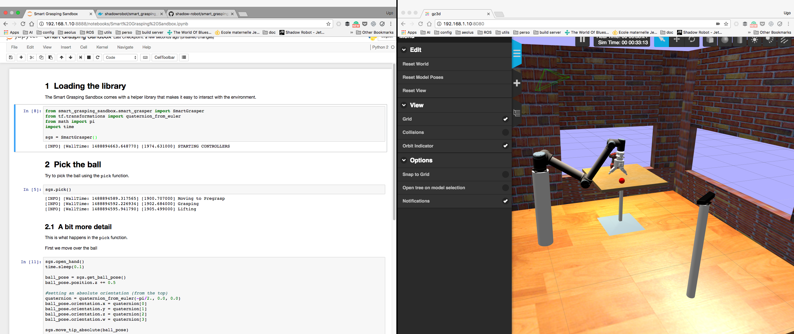

# smart_grasping_sandbox

This is a public simulation sandbox for [Shadow's Smart Grasping System](https://www.shadowrobot.com/shadow-smart-grasping-system/). We're aiming to provide you with a simplified simulation environment to play with different challenges in an autonomous pick and place problem.

This stack contains:
* **doc**: some additional documentation
* **fh_description**: the urdf description of the robot
* **smart_grasp_moveit_config**: a MoveIt! config for the motion planning
* **smart_grasping_sandbox**: the main point of entrance, includes the launch file and the main python files.



## Getting started

# setup

```
      docker run -it --name sgs -p 8080:8080 -p 8888:8888 -p 8181:8181 -p 7681:7681 -e DISPLAY=$DISPLAY -e QT_X11_NO_MITSHM=1  -v /tmp/.X11-unix:/tmp/.X11-unix:rw -v $PWD/fh_desc:/workspace/fh_desc -v $PWD/smart_grasp_moveit_config:/workspace/smart_grasp_moveit_config -v $PWD/smart_grasping_sandbox:/workspace/smart_grasping_sandbox -v /home/cthorey/.bashrc:/workspace/.bashrc shadowrobot/smart_grasping_sandbox
```

## general package struct

- Check this [link](http://answers.ros.org/question/192723/cant-find-python-scripts-after-sourcing/)

## python recommendation

- DONT FORGET TO CHANGE THE PERSMISSION ON PYTHON FILE
- PUT your module in the src folder follozing standard formatting
- Dont forget to change the permission
- Add the catkin_python_setup() to your CMakesList.txt file

## PCL 

- [pcl2rgb](http://library.isr.ist.utl.pt/docs/roswiki/pcl_ros(2f)Tutorials(2f)CloudToImage.html)
- [depth_image_proc](http://library.isr.ist.utl.pt/docs/roswiki/depth_image_proc.html)

## links

- [Frame of reference ROS](https://docs.google.com/presentation/d/1T4A_LosDlLmPMybKdU-quvhJqELOMVAMZCkzqm2Mctc/edit#slide=id.g1d38f50ea_278)
- [tutorial head tracker](http://www.pirobot.org/blog/0018/)
- if you dont want to use catkin build, do catkin clean, catkin_make
- [Circle detector](http://scikit-image.org/docs/dev/auto_examples/edges/plot_circular_elliptical_hough_transform.html)
